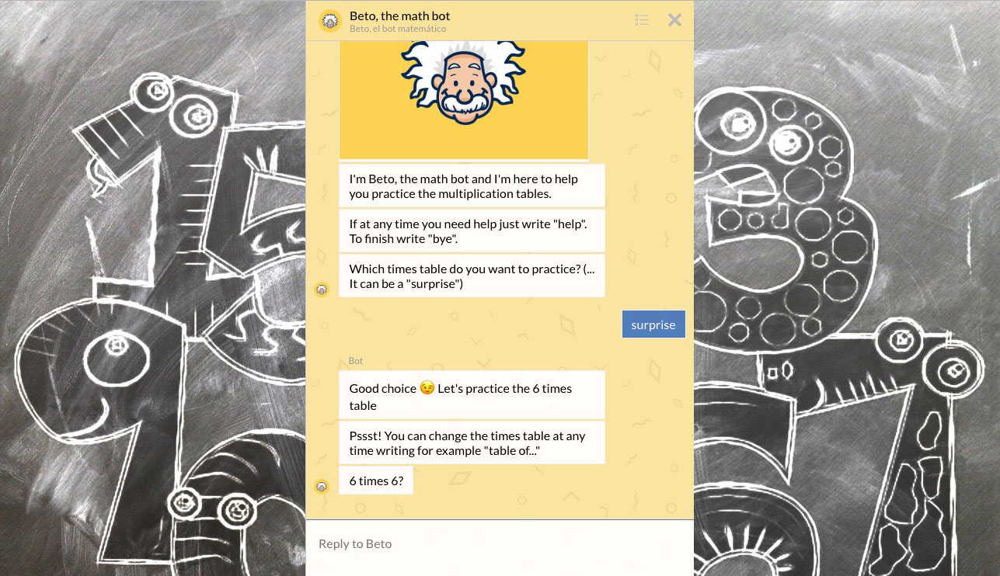
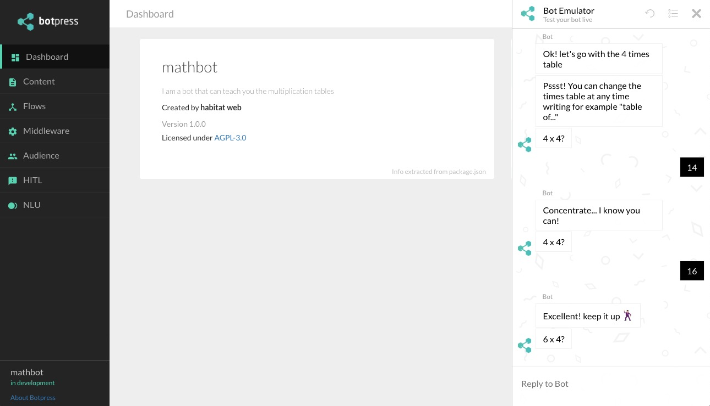

# Mathbot

Mathbot is a chatbot with which you can practice multiplication tables. Created for children, or adults too, to practice and master the tables
in a funny way.

[LIVE DEMO](http://chatbotmakers.com/tablas/)



Master branch runs with Botpress X. (Branch botpress-v1-1 is an old and deprecated version).

## Installation (Botpress X)

__Note:__ *You can only install as a global dependency a single version of botpress (either v1.x or v10.x). If you want to run a project with another version you have to indicate the path of the local installation of botpress.*

__Note:__ *Apparently, Botpress X only works properly with node versions 8.x or 9.x*

Install botpress as a global dependency

```
// using npm
npm install -g botpress@10.28.x

// using yarn
yarn global add botpresss@10.28.x
```

Clone this repository

`git clone git@github.com:roccons/hw-mathbot.git`

Enter the folder that was created after cloning

`cd hw-mathbot`

Install the dependencies

```
// using npm
npm install

// using yarn
yarn install
```

Run the chatbot with the following command

`botpress start`



If you don't have installed this version of botpress as a global dependency, run:

`node_modules/.bin/botpress start`

Enter the following address from any web browser

For dashboard:
`http://localhost:3000`

For chat only:
`http://localhost:3000/s/chat`


Say anything in the chat and just follow the instructions

---

If you [deployed](https://botpress.io/docs/latest/getting_started/trivia_deploying/) this bot to heroku you have to set some environment variables:
- Password
`heroku config:set BOTPRESS_PASSWORD=yourSecretPassword`
- Botpress url.
`heroku config:set BOTPRESS_URL=https://your-url-12345.herokuapp.com`

If you also want to use postgres in heroku instead of SQLite you have to configure the following environment variables:

_NOTE : You have to [add and configure postgres](https://elements.heroku.com/addons/heroku-postgresql) in heroku first in Resources section_

```
DATABASE = postgres,
DATABASE_URL = <url given by heroku>,
PG_HOST = <host given by heroku>,
PG_USER = <user given by heroku>,
PASSWORD = <password given by heroku>',
PG_DB = <database given by heroku>,
```